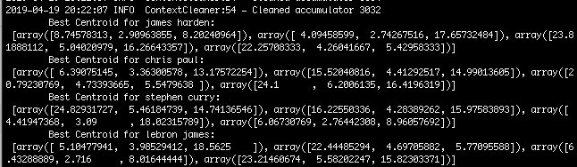
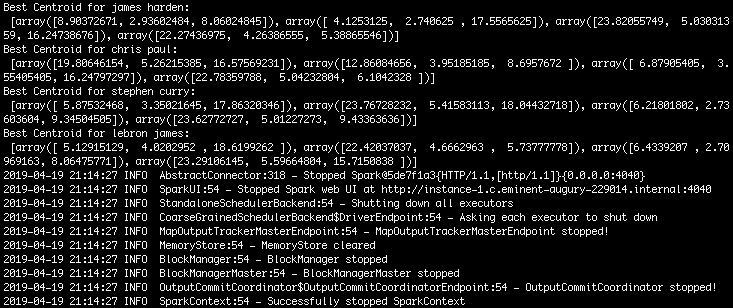

# Spark Examples

This repo make use of Spark MLlib and ML library for classification tasks. Algorithms includes:

* Kmeans
* Logistic Regression
* Decision Tree
* Random Forest


## I. KMeans with MLlib and RDD

In part I, the players are classified with the MLlib library and Spark RDD. 

### Preprocessing

Firstly, a spark session was initiated with an app name. 

```python
# set up the session 
spark = SparkSession\
    .builder\
    .appName("KMeans-MLlib")\
    .getOrCreate()
```

Next, the csv file was loaded into the spark context as RDD, parsed, cleaned, and filtered into the datapoints. After the preprocessing, the RDD are mapped into a list of arrays with 3 elements that corresponds to [SHOT_CLOCK, SHOT_DIST, CLOSE_DEF_DIST] for each player. 


### Training

Then, the cleaned RDD array list are fed into MLlib's KMean function, with the parameters of the number of clusters = 4, and the maximum number of iterations as 10. After training, the cluster centers are extrated and printed out. 

```python
model = KMeans.train(player_rdd, 4, maxIterations=10)
cluster_centers = model.clusterCenters
```




## II: KMeans with ML and DataFrame

In part II, the players are classified with the ML library and Spark Dataframe. 


### Preprocessing

Firstly, a spark session was initiated and the csv file was loaded into the spark context as dataframe with:

```python
df = spark.read.format("csv").load(sys.argv[1], header="true", inferSchema="true")
``` 

Then, the dataframe is cleaned and filtered into a 3-d dataframe with floating point values in each feature, for each player. 

```python
dataPts = df.filter(df.player_name == player).select('SHOT_DIST','CLOSE_DEF_DIST', 'SHOT_CLOCK').na.drop()
```

### Training

Next, given the ML package only takes in feature in the form of a array vector, the features are extratced and transformed by VectorAssembler: 

```python
assembler = VectorAssembler(inputCols=["SHOT_CLOCK", "SHOT_DIST", "CLOSE_DEF_DIST"], outputCol = "features")
vector = assembler.transform(dataPts).select("features")
```

Finally, the transformed feature vector was fed into the ML KMean algorithm, with the parameters of the number of clusters = 4. After training, the cluster centers are extrated and printed out. 

```python
kmeans = KMeans().setK(4).setSeed(1)
model = kmeans.fit(features)
cluster_centers = model.clusterCenters()
```




## III: Toxic Comment Classification

### Goal: 
convert the column **commen_text** into a column of sparse vectors for use in a classification algorithm in the spark ml library

### Setup 

1. copy file from local to GCP
```bash
scp -i ~/.ssh/my-ssh-key [LOCAL_FILE_PATH] [USERNAME]@[IP_ADDRESS]:~
```
2. Store the data in HDFS
3. Use DataFrame to prepare the data for Logistic Regression APIs.


